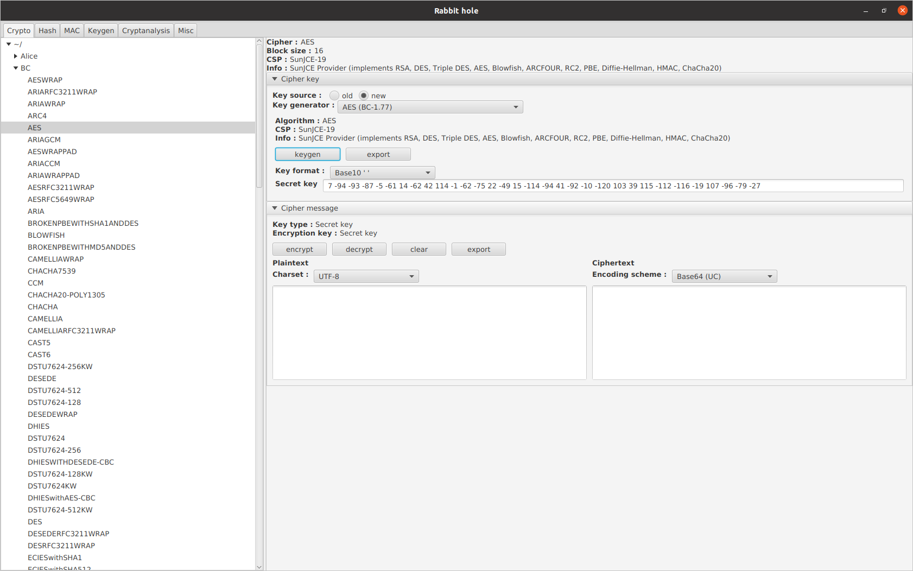
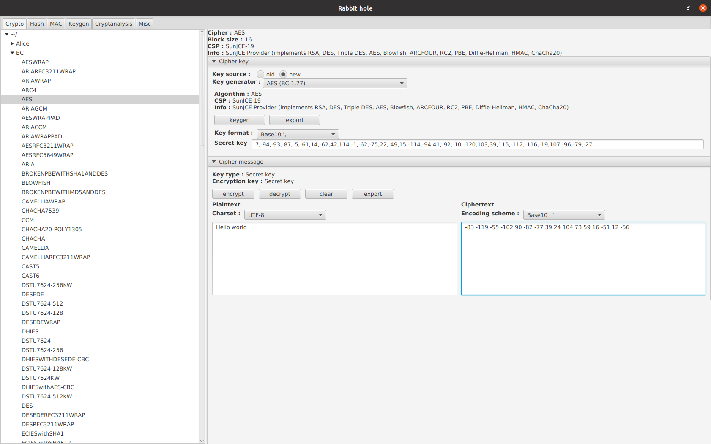
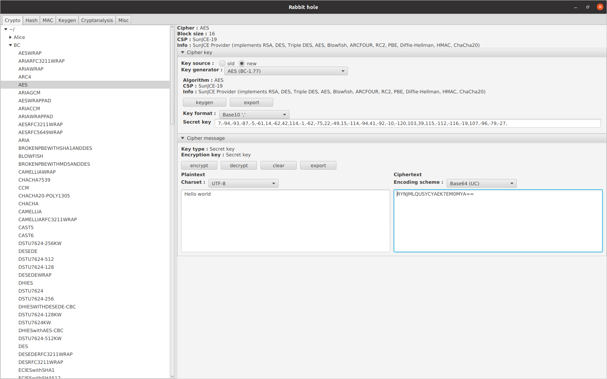
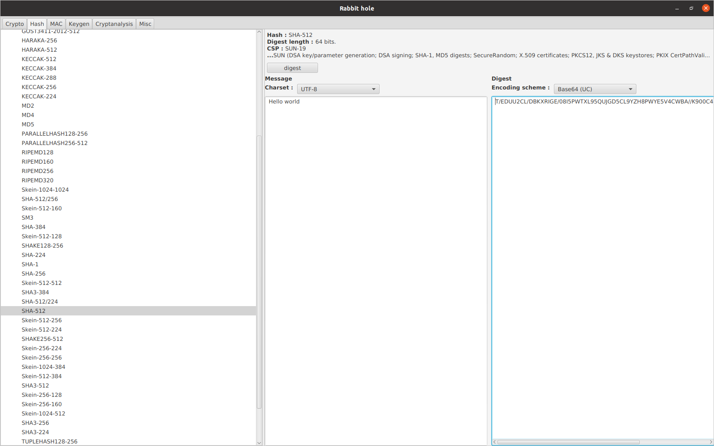
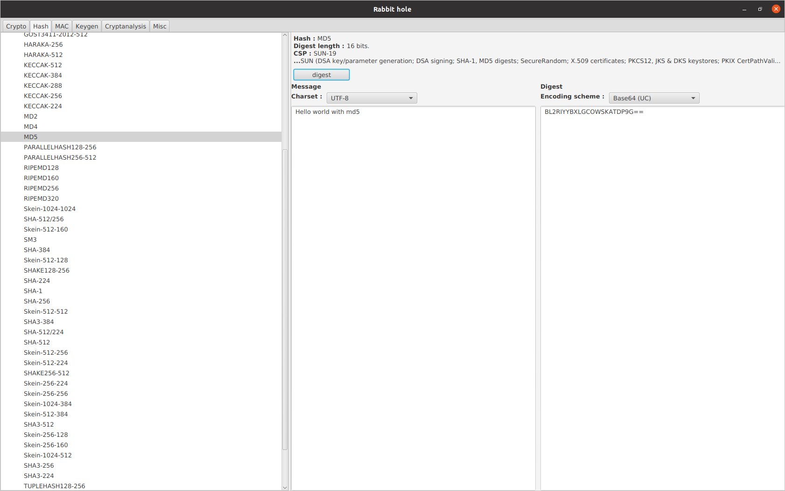
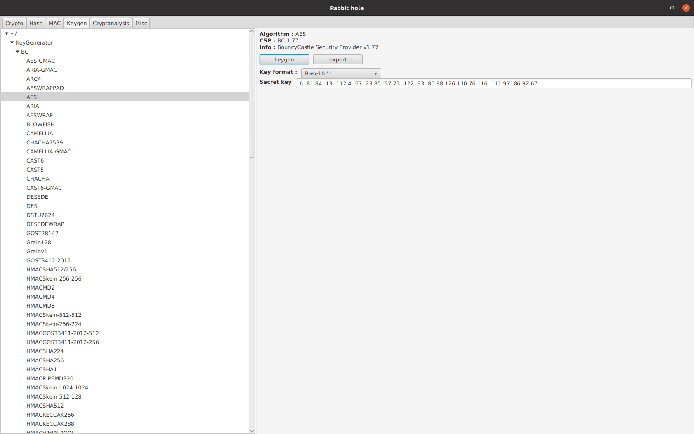
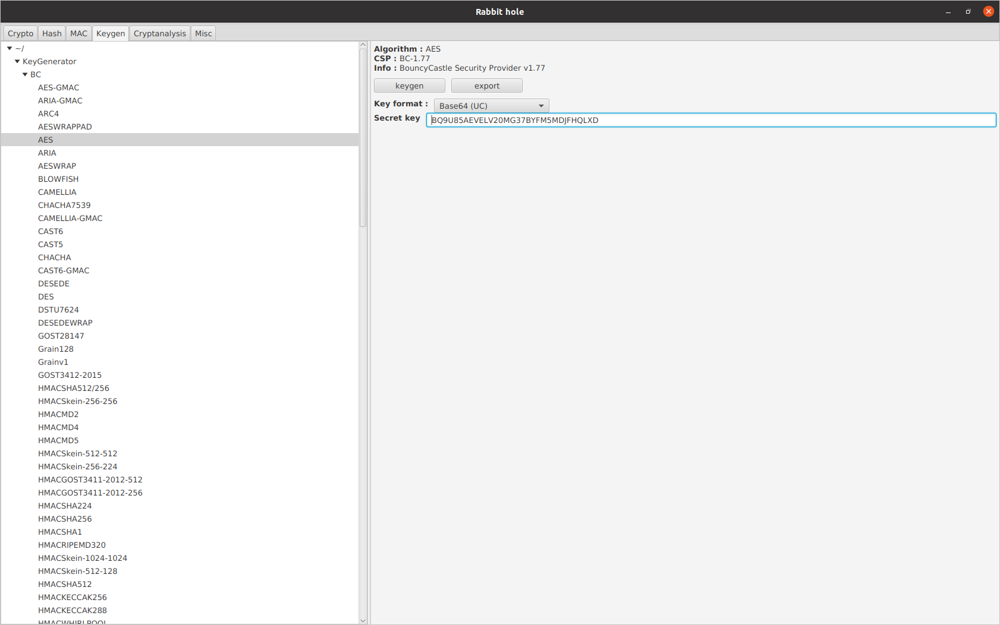

## !!! Warning read all licenses before any action, by acting you have accepted all licenses.

# wonderland #
Personal project around cryptography.

### What is alice for? ###
* Cryptographic Service Provider module
* Contains implementations about: ciphers, encoders, hash

### What is bouncy-castle for? ###
* Cryptographic module
* Wrapper/util implementations around bouncy-castle dependencies about: symmetric, asymmetric keys, keystore, hash...

### What is common for? ### 
* Common module
* Contains implementations of utils & helper methods & classes.

### What is garden for? ###
* Externalized resource module
* Externalized resource module for resources character frequency etc...
* Resource origin is supposed to be different like local file_system, redis, mysql

### What is red-queen for? ### 
* Cryptanalysis module
* Contains implementations around cryptanalysis.

### What is rabbit-hole for? ###

* Javafx gui application using modules like: alice, bouncy-castle, garden, red-queen, conscrypt etc.
* cipher ui :
  
  
  
  

* hash ui
  
  

* keygen ui :
  
  
  
  
