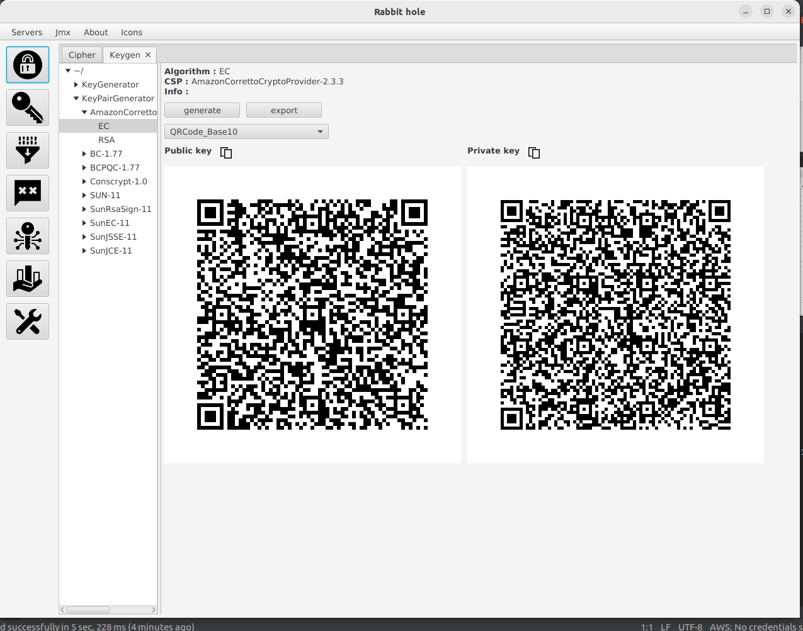

# wonderland

- Project around cryptography.
- Warning !!! read all licenses before any action, by acting you have accepted all licenses.

## Modules:

- alice
- base
- crypto
- garden
- garden-files
- grpc
- hatter
- protos
- rabbit-hole
- red-queen

### What is alice for ?

* Cryptographic Service Provider module
* Conforming to JAVA JCA , contains implementations about: ciphers,keys, encoders.
* Work in progress, not production ready !!!.

### What is crypto for ?

- Cryptographic module

* High level wrapper/util implementations around already JAVA CSP.

- Work in progress

### What is base for ?

- base module
- Contains implementations of utils & helper methods & classes.

### What is grpc for ?

- grpc module
- Contains grpc implementations to be used on integration.

### What is protos for ?

- protos module
- Contains service definitions in proto files.

### What is hatter for ?

- hatter module
- TODO: A key-escrow application/server using spring.

### What is garden for ?

- Externalized resource module
- Externalized resource module for resources letter frequency etc...
- Resource origin is supposed to be different like local file_system, redis, mysql

### What is red-queen for ?

- Cryptanalysis module
- Contains implementations around cryptanalysis.
- Work in progress

### What is rabbit-hole for ?

- Javafx gui application using wonderland modules.

<table>
<thead>Integrated cryptographic service providers :</thead>
<tr><td>Bouncy Castle</td></tr>
<tr><td>Sun</td></tr>
<tr><td>SunJCE</td></tr>
<tr><td>Conscrypt</td></tr>
<tr><td>AmazonCorretoCryptoProvider</td></tr>
<tr><td>Alice</td></tr>
</table>

- Screenshots of rabbit-hole app :
  
   
  

## Licenses

Note: while wonderland project comes in below licenses,

- [GNU General Public License v3.0](https://github.com/gentjankolicaj/wonderland/blob/master/LICENSE)
- [Custom License 2](https://github.com/gentjankolicaj/wonderland/blob/master/LICENSE_2)

portions/parts/lines of this project include software dependencies licensed under different
licenses.
External cryptographic service providers have their licenses accordingly.
Please see licenses for below cryptographic service providers:

- https://github.com/bcgit/bc-java
- https://github.com/corretto/amazon-corretto-crypto-provider
- https://github.com/openjdk/jdk
- https://github.com/google/conscrypt