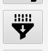
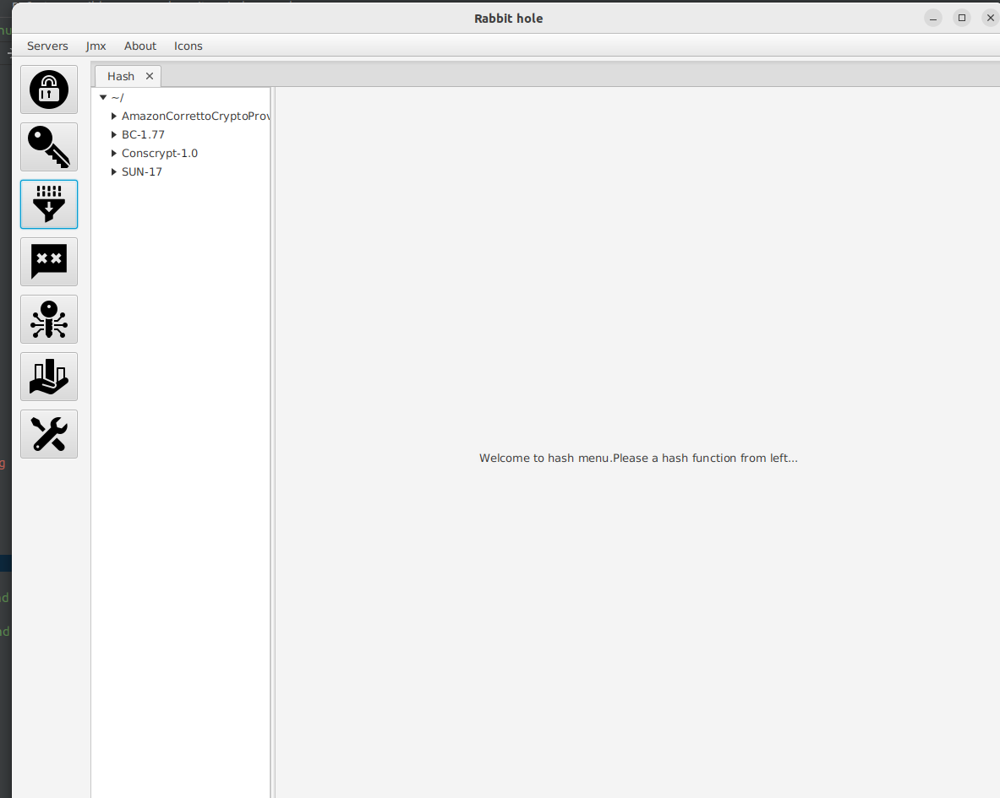

# hash ui

- This manual describes how use hash ui.

<ol>
<li>
  
 Click hash icon

  
</li>
 
<li>
   
Hash tab is opened

  
</li>
 
<li>
  
 Select a hash algorithm from cryptographic service providers.Type message and click digest to hash.

  
</li>

</ol>