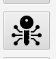
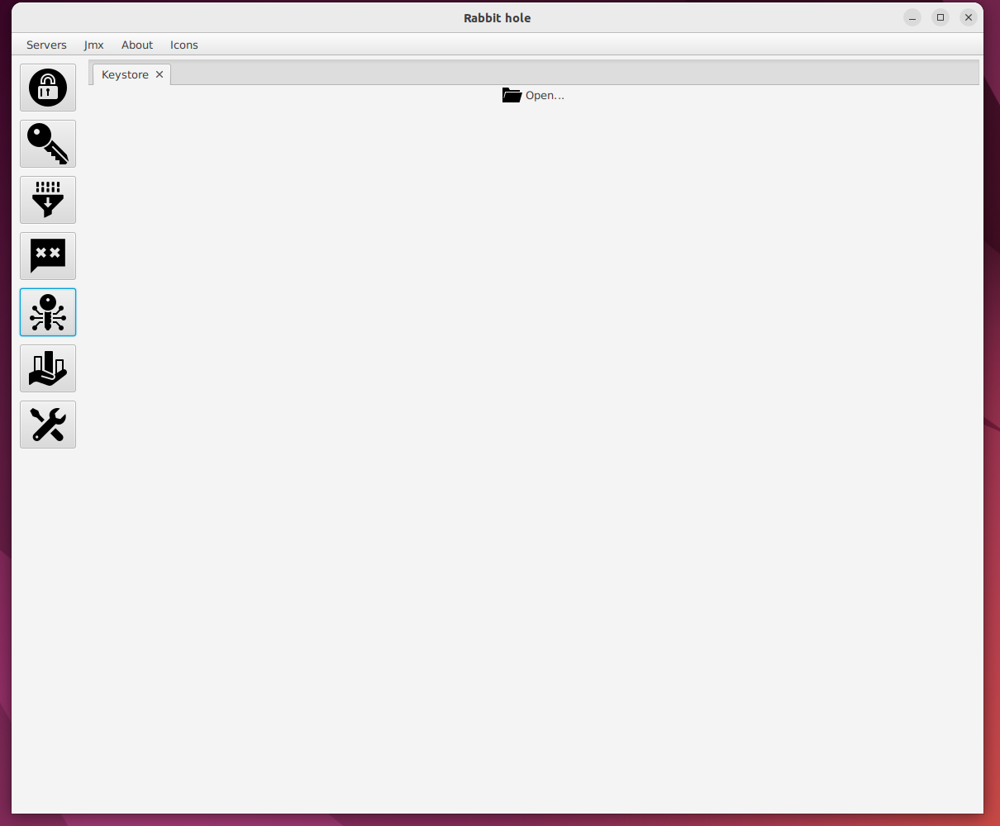
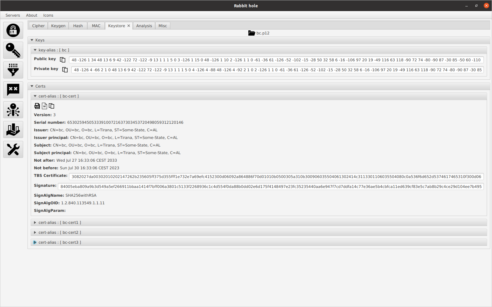

# keystore ui

- This manual describes how to use keystore ui.

<ol>
<li>
  
 Click keystore icon

  
</li>
 
<li>
   
Keystore tab is opened

  
</li>
 
<li>
  
Click open icon and follow the steps

  
</li>

</ol>