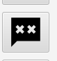
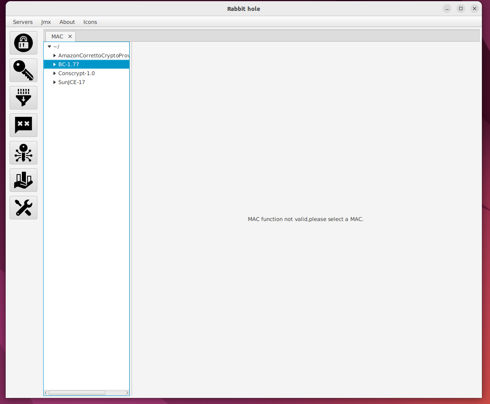
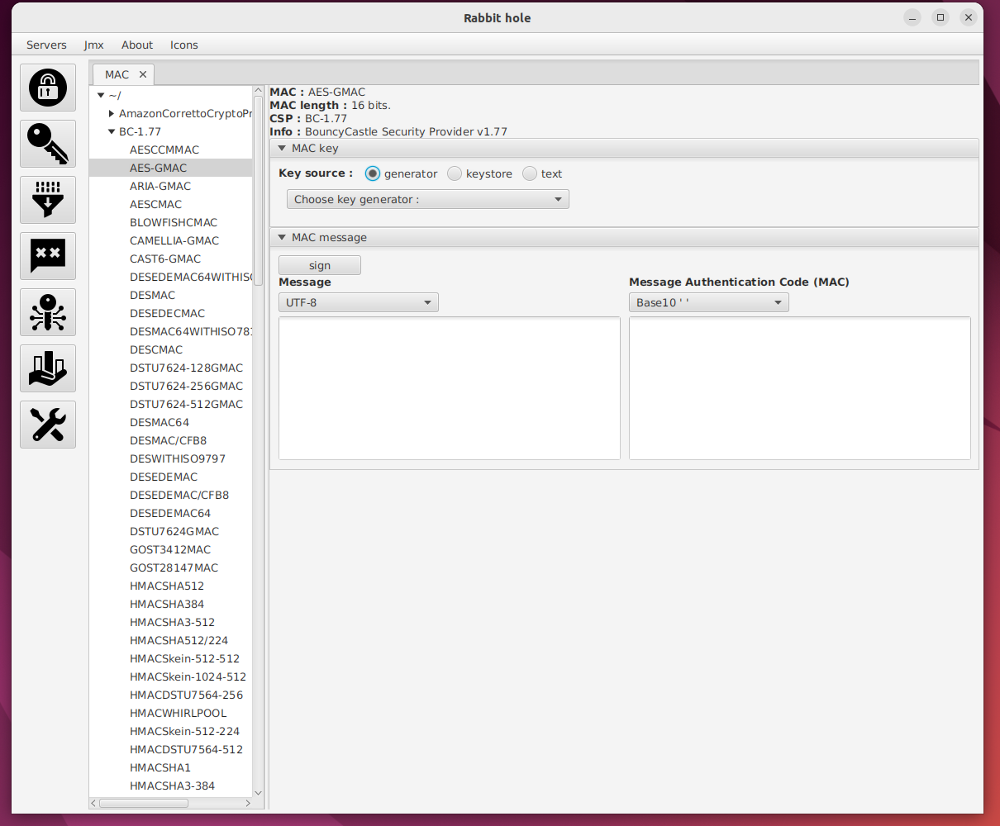
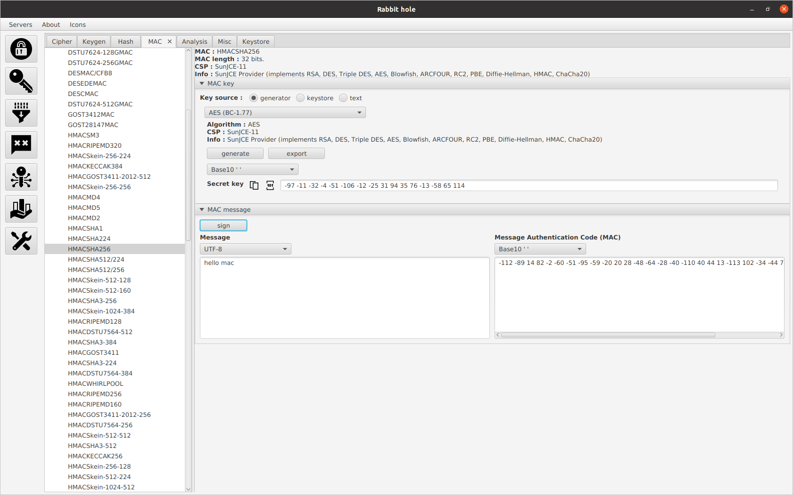

# mac ui

- This manual describes how to use mac ui.

<ol>
<li>
  
 Click mac icon

  
</li>
 
<li>
   
MAC tab is opened

  
</li>
 
<li>
  
 Select a MAC algorithm from cryptographic service providers

  
</li>
 
<li>
<table>
<thead>At 'MAC key' select keysource type : </thead>
<tr><td>generator</td><td>Generates keys based on chosen algorithm</td></tr>
<tr><td>keystore</td><td>Loads keys from keystore</td></tr>
<tr><td>text</td><td>Reads keys from text input</td></tr>
</table>
</li>
 
<li>
 <table>
 <tr><td>To sign</td><td>insert message at plaintext area & click sign button</td></tr>
</table>

</li>
</ol>