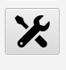
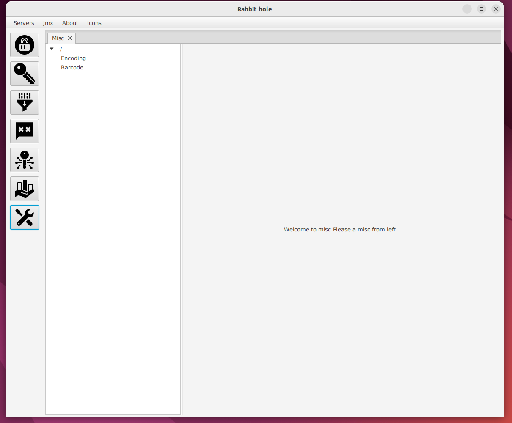
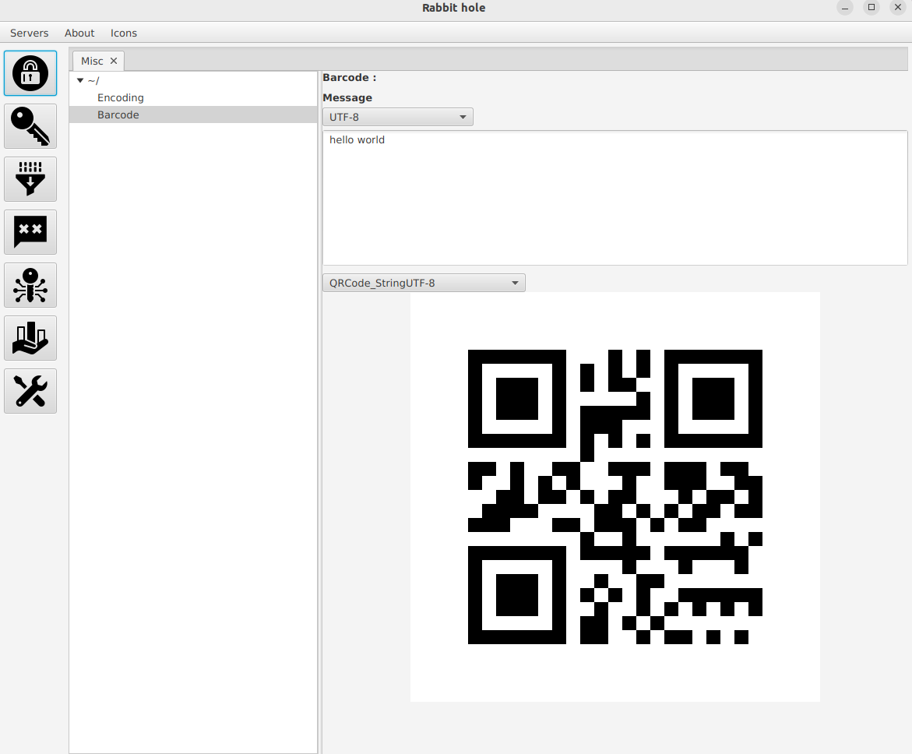

# misc ui

- This manual describes how to use misc ui.

<ol>
<li>
  
Click misc icon

  
</li>
 
<li>
   
Misc tab is opened

  
</li>
 
<li>
  
Select an option from misc tab and start processing.Example below is selected barcode

  
</li>
</ol>