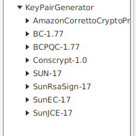
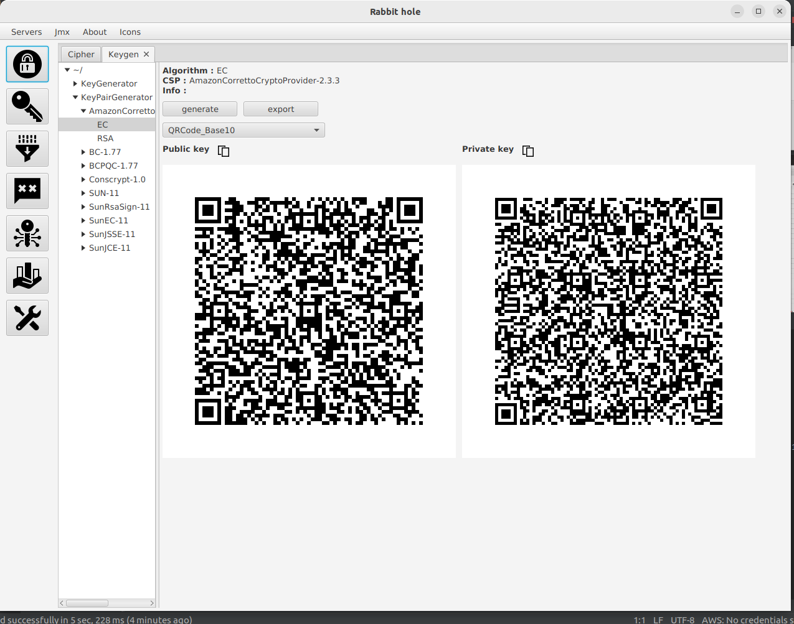

# public-key ui

- This manual describes how to use public-key ui.

<ol>
<li>
  
Click key icon

  
</li>
 
<li>
   
KeyPair tab is opened

  
</li>
 
<li>
  
Select a keypair generator algorithm from cryptographic service providers.After that click generate button

  
</li>
</ol>