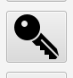
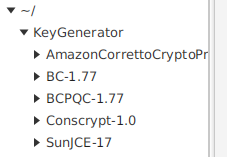
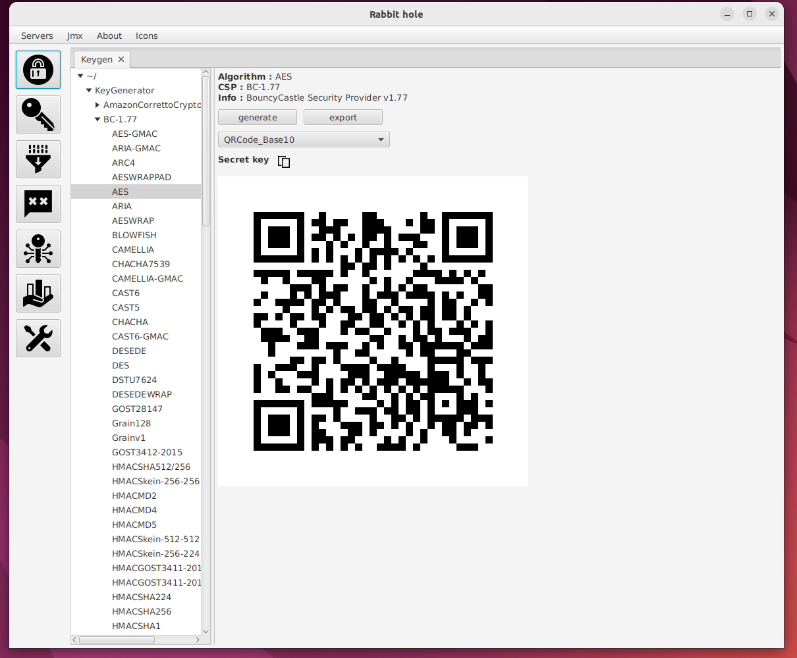

# secret-key ui

- This manual describes how to use secret-key ui.

<ol>
<li>
  
Click key icon

  
</li>
 
<li>
   
Key tab is opened

  
</li>
 
<li>
  
 Select a key generator algorithm from cryptographic service providers.After that click generate button

  
</li>
</ol>