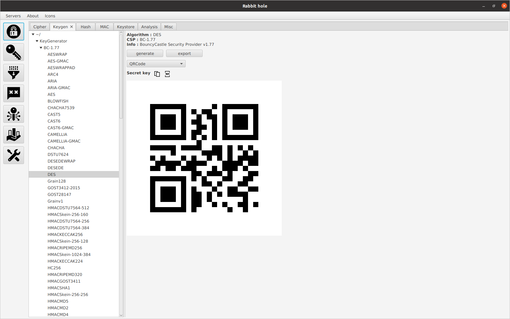

### What is rabbit-hole for ? ###

* Javafx gui application using modules like: alice, base, crypto, garden, red-queen etc.

<table>
<thead>Integrated cryptographic security providers :</thead>
<tr><td>Bouncy Castle</td></tr>
<tr><td>Sun</td></tr>
<tr><td>SunJCE</td></tr>
<tr><td>Conscrypt</td></tr>
<tr><td>Alice</td></tr>
</table>

#### Cipher :

 

#### Hash :

 

#### Keygen :

 

#### MAC (Message Authentication Code) :

 

#### Keystore :

 

#### Analysis :

 

#### Misc :

